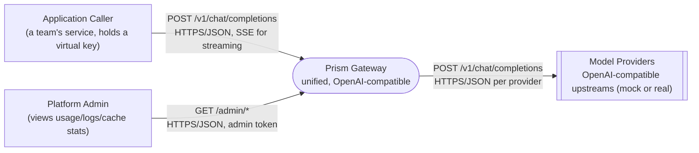
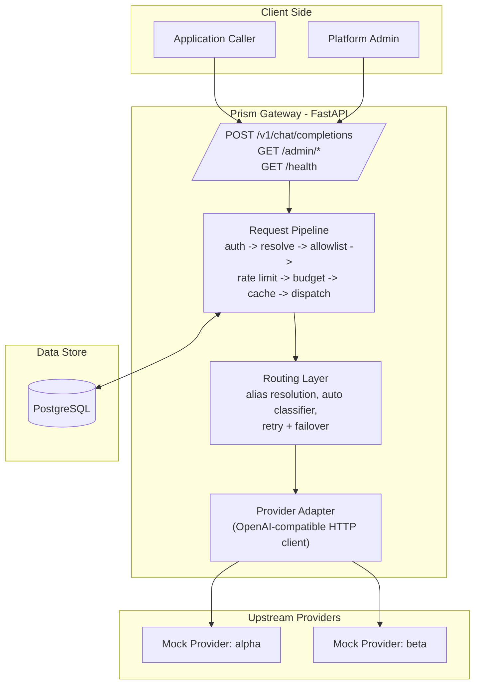
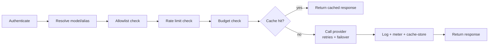
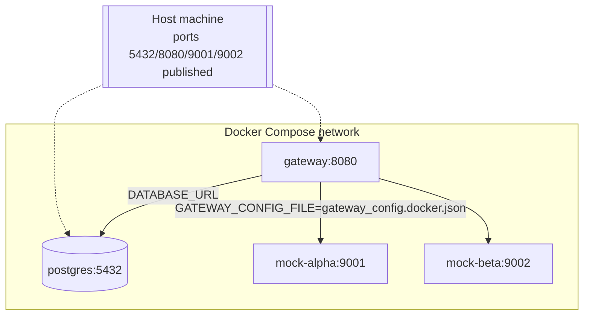

# High-Level Design — Prism LLM Gateway

Audience: engineers with general backend/web knowledge (REST, HTTP, SQL, containers) but
no prior context on this specific project. For a beginner-friendly, line-by-line walkthrough
see [HOW_IT_WORKS.md](HOW_IT_WORKS.md). For implementation-level detail (schemas, algorithms,
sequence diagrams) see [LLD.md](LLD.md).

---

## 1. Problem Statement

Applications that call LLM providers directly end up re-solving the same set of problems per
team: provider failover, per-tenant auth/budgets/rate limits, streaming, cost accounting, and
avoiding redundant spend on repeated questions. Prism centralizes all of that behind one
OpenAI-compatible API, and additionally makes two AI-adjacent decisions in the request path
itself:

1. **How hard is this prompt** → route it to a cheap or an expensive model tier.
2. **Have we answered this before** → serve it from cache instead of paying for it again.

Full functional scope: [`PRISM_PROBLEM_STATEMENT.md`](../PRISM_PROBLEM_STATEMENT.md).

---

## 2. System Context

Prism is the **only** thing that ever holds provider credentials. Callers never see a
provider's real model name or API key — only aliases (`fast`, `smart`, `auto`) and their own
virtual key.

---

## 3. Container / Component View

| Component | Responsibility | Key files |
|---|---|---|
| **API layer** | HTTP surface: routes, request/response shaping, SSE streaming | `app/routers/chat.py`, `app/routers/admin.py` |
| **Request pipeline** | Enforces every Must Have policy in a fixed order before any provider is called | `app/routers/chat.py` (orchestrates the modules below) |
| **Auth & policy** | Virtual key lookup, allowlist, rate limit, budget | `app/auth.py`, `app/rate_limit.py`, `app/budget.py` |
| **Routing layer** | Alias → model resolution, `auto` tier classification, retry/failover state machine | `app/routing/*` |
| **Semantic cache** | Bag-of-words similarity match/store, scoped per tenant | `app/cache.py`, `app/semantic.py` |
| **Provider adapter** | Talks HTTP to upstream providers behind a common interface | `app/adapters/*` |
| **Persistence** | Tenants, request logs, rate-limit counters, budget counters, cache entries | `app/models.py`, `app/db.py`, PostgreSQL |
| **Observability** | Per-request audit trail + read APIs over it | `app/request_log.py`, `app/routers/admin.py` |

---

## 4. Technology Choices & Rationale

| Decision | Choice | Why |
|---|---|---|
| Language/framework | Python + FastAPI | Async-native, so one slow provider call doesn't block other requests; automatic request validation and OpenAPI docs for free. |
| Database | PostgreSQL | Needs to survive restarts (keys, logs, usage) *and* provide real atomic read-modify-write for rate limits/budgets under concurrency — an in-memory store alone can't give both durability and cross-process safety. |
| DB driver | `asyncpg` via SQLAlchemy's async engine | Keeps database calls non-blocking, consistent with the rest of the async request path. |
| Provider protocol | OpenAI-compatible HTTP/SSE | The data plane contract is fixed by the spec (`docs/API_CONTRACT.md`) — every provider, mock or real, is normalized behind the same adapter interface. |
| Semantic cache | Bag-of-words cosine similarity (no embedding model/API) | Fully offline, zero external dependency, documented acceptable substitute; trades ceiling accuracy on very different phrasings for zero cost/latency/setup. |
| `auto` router | Hand-engineered keyword signals (no LLM judge) | Mock providers return canned text and can't act as a judge; a keyword classifier is deterministic, instant, and fully explainable per decision (logged reason). |
| Containerization | Docker Compose (Postgres + 2 mock providers + gateway) | One-command reproducible environment on any machine; no host-level Python/Postgres install required. |
| Admin auth | RS256-signed JWTs (access + refresh), password hashed with bcrypt | Asymmetric signing means only the code that mints tokens ever needs the private key; short-lived stateless access tokens keep per-request auth cheap, while DB-tracked refresh tokens (rotated, revocable) contain the blast radius of a leaked credential without paying that DB cost on every request. |

---

## 5. Request Flow (high level)

Every request to the data plane passes through the same ordered pipeline. Full detail in
[LLD.md §4](LLD.md#4-request-pipeline-detail).

Any check failing short-circuits immediately with a distinct, logged error — the request
never reaches a provider unless every policy check passed.

---

## 6. Non-Functional Requirements & How They're Met

| Requirement | Mechanism |
|---|---|
| **Reliability** | Every upstream call has a timeout; transient errors retry with exponential backoff; failed candidates fail over to the next provider in the alias's fallback chain (§ LLD retry/failover). |
| **No client hangs** | `httpx` client timeout wraps every provider call — a dead/slow provider can never hang a caller indefinitely. |
| **Correctness under concurrency** | Rate limiting and budget admission use single atomic SQL statements (`INSERT ... ON CONFLICT ... DO UPDATE ... RETURNING`), not read-then-write — verified with real concurrent load (`scripts/load_test.py`), zero over-admission. |
| **Multi-tenancy isolation** | Every tenant-scoped table (`virtual_keys`, `cache_entries`, budget/rate-limit counters) is filtered by `virtual_key` on every query — a cache hit or budget check can never cross tenants. |
| **Streaming without buffering** | SSE lines are forwarded to the client as they're read from the provider — never assembled into a full response first. |
| **Auditability** | One `request_logs` row per request, success or rejection, with cost/tokens/latency/cache/fallback/retry detail. |
| **Security** | Provider API keys live only in gateway config, never returned to clients or logged. Data-plane traffic authenticates with virtual keys; the admin plane has its own separate login (username/password → RS256-signed JWT access + refresh tokens, 30-min access token lifetime, rotating/revocable refresh tokens) — see LLD §4.11. |
| **Portability** | Entire stack (DB + both mock providers + gateway) runs via `docker compose up --build` with no host dependencies beyond Docker. |

---

## 7. Deployment View

Two config variants exist for the same gateway image/code:
- **Local dev**: gateway runs on the host, reaches Postgres and mock providers via
  `localhost` (`backend/config/gateway_config.json`).
- **Docker Compose**: gateway runs as a container, reaches everything by service name
  (`backend/config/gateway_config.docker.json`), selected via the `GATEWAY_CONFIG_FILE`
  environment variable. No code differs between the two — only which JSON config file loads.

---

## 8. Key Design Trade-offs

| Decision | Trade-off accepted | Why it's acceptable here |
|---|---|---|
| Bag-of-words cache instead of embeddings | Misses paraphrases with fully different vocabulary (e.g. "refund" vs "money back") | Explicitly allowed by spec as a documented local substitute; zero-dependency and offline. |
| Keyword-based `auto` router instead of an LLM judge | A genuinely novel prompt outside the signal vocabulary falls back to a weak length heuristic | Mock providers can't act as judges anyway; scores 100% on the provided eval set with fully logged reasoning per decision. |
| Budget admission checked before cost is known | A burst of concurrent requests can slightly overshoot the monthly budget | Documented in the spec as acceptable — exact cost is only known after the provider responds; the alternative (blocking until the true cost is known) would serialize all traffic per key. |
| Single-instance rate limiting (DB-backed, not Redis) | Doesn't horizontally scale across multiple gateway instances (Stretch scope) | DB-backed atomic counters are still correct for the current single-instance deployment target — see LLD for exactly why they're race-safe despite not being in-memory. |
