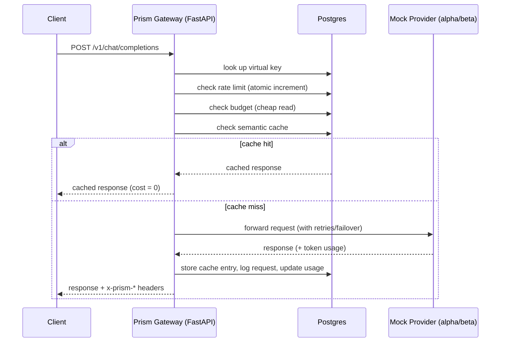
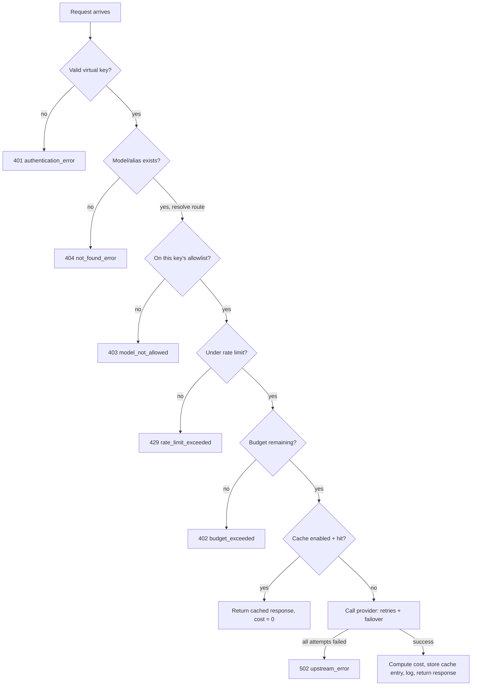

# How Prism's Backend Works

This document explains the gateway from the ground up: what it does, why it's built the
way it is, where each piece of behavior lives in the code, and how a request actually
flows through the system. It assumes **no prior Python or FastAPI knowledge**.

If you just want to run the thing, see [AGENTS.md](../AGENTS.md) for commands. This
document is about understanding it.

---

## 1. What this is, in plain English

Prism sits between "your app" and "the AI providers" (OpenAI, Anthropic, or in this
project's case, two mock providers that pretend to be AI models). Instead of your app
calling providers directly, it calls Prism, and Prism:

- picks which provider/model actually serves the request (and can switch providers if
  one is down),
- makes sure the caller is allowed to make the request (valid key, not rate-limited,
  has budget left),
- streams the answer back token-by-token if asked,
- remembers repeated questions so it doesn't pay for the same answer twice,
- and writes down exactly what happened, for every single request, so it can be
  billed and debugged later.

Nothing here is "smart" in a magical sense — it's a careful pipeline of checks, and
two small pieces of decision-making logic (which model tier to use, whether a new
prompt is "the same as" an old one).

---

## 2. The big picture



Everything the gateway does is either **a check before calling a provider** or
**bookkeeping after calling one**. There is no AI model running inside the gateway
itself — the "intelligence" (routing and caching decisions) is plain Python logic,
described in section 6.

---

## 3. Folder map — what lives where, and why

```
backend/
├── app/
│   ├── main.py                  entry point: creates the FastAPI app, wires routers
│   ├── config.py                loads settings + the JSON data files (prices, keys, config)
│   ├── db.py                    sets up the database connection
│   ├── models.py                the database tables, defined as Python classes
│   ├── seed.py                  copies data/seed_keys.json into the database on startup
│   ├── auth.py                  "is this a valid key?" + the error-response shape
│   ├── rate_limit.py            "has this key made too many requests this minute?"
│   ├── budget.py                "has this key spent its monthly budget?"
│   ├── cache.py                 semantic cache lookup/store logic
│   ├── semantic.py              the text-similarity math the cache uses
│   ├── streaming.py             forwards a live token stream to the client
│   ├── request_log.py           writes one row to request_logs per request
│   ├── providers.py             builds the list of upstream providers from config
│   ├── adapters/
│   │   ├── base.py              the interface every provider adapter must implement
│   │   └── openai_compatible.py the actual HTTP client that talks to a provider
│   ├── routing/
│   │   ├── aliases.py           turns "fast" / "smart" / a model name into a provider+model
│   │   ├── auto_router.py       the "auto" tier classifier (fast vs smart)
│   │   ├── dispatch.py          retry + failover logic (tries providers in order)
│   │   └── pricing.py           cost = tokens × price-per-model
│   └── routers/
│       ├── chat.py              the POST /v1/chat/completions endpoint (the whole pipeline)
│       └── admin.py             /health, /admin/usage, /admin/logs, /admin/cache/stats
├── config/
│   └── gateway_config.json      which providers exist, alias → model mappings, retry policy
├── scripts/
│   └── routing_eval.py          grades the auto-router against data/routing_eval.jsonl
├── requirements.txt             the exact list of Python packages this project needs
└── .env / .env.example          local secrets/settings (database URL, admin token, etc.)
```

**Why split it up like this?** Each file answers one question. If you're asking "why
did this request get rejected?", you look at `auth.py` / `rate_limit.py` / `budget.py`.
If you're asking "why did it pick this model?", you look at `routing/`. If you're
asking "why did it think this was a repeat question?", you look at `cache.py` /
`semantic.py`. The file names are the map.

---

## 4. A few Python/FastAPI concepts you'll keep seeing

You don't need to know Python to follow this doc, but these five ideas explain 90% of
what looks unfamiliar in the code:

| Concept | What it means here |
|---|---|
| `async def` / `await` | This function can pause while waiting on something slow (a database query, a network call) *without blocking other requests*. Almost every function in this codebase is `async` because the gateway needs to serve many requests at once without one slow provider call freezing everyone else. |
| FastAPI "route" (`@router.post("/v1/chat/completions")`) | This just says "when an HTTP POST request arrives at this URL, run the function below it." |
| `Depends(...)` | FastAPI's way of saying "before running this endpoint, run this other function first and hand me its result." We use it for two things: getting a database session (`Depends(get_db)`), and gating admin routes behind a valid login token (`Depends(require_admin_jwt)`). |
| SQLAlchemy "model" (the classes in `models.py`) | Each class (e.g. `VirtualKey`, `RequestLog`) is a Python description of one database table. Instead of writing raw SQL everywhere, the code creates/reads Python objects and SQLAlchemy translates that into SQL. |
| Pydantic `Settings` (`config.py`) | A typed way of reading environment variables (from `.env`) with defaults, so the rest of the code just does `get_settings().database_url` instead of scattering `os.environ` calls everywhere. |

---

## 5. The full request lifecycle, step by step

This is the heart of the document. Every non-streaming or streaming chat request goes
through the **same pipeline**, defined top-to-bottom in
[`app/routers/chat.py`](app/routers/chat.py). Each step either passes (moves to the
next one) or rejects the request immediately with a specific error and a logged reason.



Every rejection box (`RJ1`–`RJ6`) still writes a row to the `request_logs` table before
the error is returned to the client — see step 5.9. Nothing that reaches the gateway
goes unrecorded, including rejections.

### 5.1 — Authenticate the key
**File:** `app/auth.py`, function `authenticate()`.
**What:** Reads the `Authorization: Bearer <key>` header, looks the key up in the
`virtual_keys` table.
**Why:** Every caller must be a known, active tenant — this is how spend and traffic
get attributed to a team, and how a stolen/typo'd key gets rejected immediately.
**How:** A single `SELECT` against `virtual_keys` by the `key_hash` column (it's
indexed, so this is fast). If the key doesn't exist or its `status` isn't `"active"`,
raise a `GatewayError(401, ...)`.

### 5.2 — Resolve the model/alias
**File:** `app/routing/auto_router.py` (`resolve_route`) → `app/routing/aliases.py`
(`resolve_candidate_chain`).
**What:** Turns whatever the caller sent as `"model"` (`"fast"`, `"smart"`, `"auto"`,
or a literal provider model name) into an ordered list of *candidates* to try: a
primary model + its fallback chain, each already tied to the provider that serves it.
**Why:** Callers should never need to know real provider model names (`alpha-small`) —
that's the whole point of aliases. It also has to happen before the allowlist check,
so a genuinely unknown model name gets a `404` instead of being silently absorbed into
a `403`.
**How:** Looks up the alias in `config/gateway_config.json`'s `model_aliases`. If the
model is `"auto"`, this step first calls the classifier (section 6.7) to decide `fast`
or `smart`, *then* resolves that tier's chain — so `auto` reuses the exact same
resolution code as a literal `"fast"` request once the tier is chosen.

### 5.3 — Check the allowlist
**File:** `app/auth.py`, function `enforce_allowlist()`.
**What:** Confirms the *requested alias/model string* (e.g. `"smart"`) is in this key's
`model_allowlist` (loaded from `data/seed_keys.json` at startup).
**Why:** A team on the free tier shouldn't be able to call the expensive `smart` model
just because they know the alias name exists.
**How:** A plain Python `in` check against the list already loaded on the `key` object
— no extra database query needed here.

### 5.4 — Check the rate limit
**File:** `app/rate_limit.py`, function `enforce_rate_limit()`.
**What:** Rejects the request if this key has already made `requests_per_minute`
requests in the current 60-second window.
**Why:** Protects the gateway and upstream providers from being hammered by one
tenant, and is one of the two things `scripts/load_test.py` specifically checks —
that under *concurrent* traffic, exactly N requests get admitted per window, never
N+1.
**How, in plain terms:** every request does one atomic
"increment-the-counter-and-tell-me-the-new-value" database operation against a
`rate_limit_windows` row keyed by `(virtual_key_id, window_start)`. Because Postgres
processes that single statement as one atomic unit, two requests arriving at the exact
same instant still get *different* counter values back (e.g. one gets `10`, the other
gets `11`) — there's no gap where both could "read count=9, then both write count=10."
That's what makes it safe under real concurrency instead of just in testing.

### 5.5 — Check the budget
**File:** `app/budget.py`, functions `enforce_budget()` / `record_usage()`.
**What:** Rejects the request if this key has already spent its `monthly_budget_usd`.
**Why:** Lets a team cap their own spend (and lets you demo hitting a budget limit
live, per the capstone's demo script).
**How:** This is a **cheap read**, not a scan of every past request: there's a
separate `usage_records` table with one row per `(virtual_key_id, year_month)` holding a
running `spend_usd` total. The check is just "is `spend_usd >= monthly_budget_usd`?".
The actual cost of *this* request isn't known yet (the provider hasn't answered), so
this is admission control only — after the provider responds, `record_usage()` does
another atomic increment-and-add to that same row (step 5.9). This means, as
documented in `docs/DATA_MODEL.md`, a burst of concurrent requests admitted while
budget remained could push spend slightly over budget — an accepted, documented
trade-off, not a bug.

### 5.6 — Check the semantic cache (non-streaming only)
**File:** `app/cache.py` (`find_cache_hit`), math in `app/semantic.py`.
**What:** If this key has caching enabled, compares the new prompt against every
previously cached prompt *for this same key and this same alias*, and if one is
similar enough (above the key's configured threshold), returns that old answer
instead of calling a provider at all.
**Why:** If ten people ask "how do I reset my password," there's no reason to pay a
provider ten times for near-identical answers.
**Why scoped per key?** Serving Team A's cached answer to Team B would leak Team A's
traffic content across a tenant boundary — treated as a data leak per the spec, so
cache entries are always looked up filtered by `virtual_key_id`.
**Why not for streaming?** A streamed response's cost/shape is different from a
non-streaming one, and replaying a cached answer as a fake stream adds real
complexity for a Must Have feature — the project's documented choice was to skip the
cache entirely for `"stream": true` requests. See section 6.6 for the similarity math.

### 5.7 — Call the provider (with retries and failover)
**File:** `app/routing/dispatch.py` (`dispatch_non_streaming` / `dispatch_streaming`),
actual HTTP calls in `app/adapters/openai_compatible.py`.
**What:** Tries the primary candidate from step 5.2. If it fails with something
"worth retrying" (a timeout, or a 429/5xx), it retries the *same* provider a few
times with increasing delay (exponential backoff). If it still fails, it moves to the
next candidate in the fallback chain (e.g. `beta-small` after `alpha-small`) and
starts the retry cycle over there.
**Why:** This is what makes "provider goes down" survivable — the client never sees
the outage, just a slightly slower response and an `x-prism-fallback: true` header.
**How:** See section 6.4 for the full mechanics, including exactly which failures are
considered "worth retrying" vs. "give up on this candidate immediately."

### 5.8 — Stream vs. return
**File:** `app/streaming.py` (streaming path), inline in `chat.py` (non-streaming
path).
If `"stream": true`, the client gets a `StreamingResponse` that forwards the
provider's Server-Sent-Events lines to the client as they arrive — see section 6.5
for what happens if the connection dies partway through. Otherwise, the full response
body is returned as normal JSON once the provider has answered.

### 5.9 — Compute cost, store cache entry, log, return
**Files:** `app/routing/pricing.py` (`compute_cost_usd`), `app/cache.py`
(`store_cache_entry`), `app/request_log.py` (`log_request`).
**What:** Cost is computed strictly from the token counts *the provider reported* in
its `usage` object — never from anything the client claimed — multiplied by the
per-model price from `data/model_pricing.json`. If caching is on for this key, the
new (prompt, response) pair gets saved for future lookups. One row is written to
`request_logs` no matter what happened (success, cache hit, or any rejection along
the way), and the response headers (`x-prism-provider`, `x-prism-cache`,
`x-prism-fallback`, `x-prism-cost-usd`) get set right before the response leaves.

---

## 6. Subsystem deep dives

### 6.1 Virtual keys & authentication
A "virtual key" is just this gateway's name for an API key that represents a *team*,
not a person. On startup, `app/seed.py` reads `data/seed_keys.json` and
upserts each tenant into the `virtual_keys` table (see `app/models.py`), so the
database always matches that file's values even across restarts. `app/auth.py` is the
only place that reads the `Authorization` header for the data plane. The admin plane
(`/admin/*`) uses a completely separate login system, covered in its own section: 6.9.

### 6.2 Rate limiting
Explained mechanically in step 5.4 above. The important design point: this is **not**
"read the current count, check it, then write count+1" as two separate steps — that
pattern has a race condition (two requests can both read the same "under limit" count
before either writes back). Instead it's a single SQL statement
(`INSERT ... ON CONFLICT ... DO UPDATE SET count = count + 1 RETURNING count`, in
`app/rate_limit.py`) that increments and returns the new value in one atomic
operation, so Postgres itself — not application code — guarantees no two requests
ever see the same "you're number N" answer.

### 6.3 Budgets
Explained in step 5.5. Two tables cooperate on purpose:
- `usage_records` (one row per key per month) is the **fast path** — a single indexed
  row read/write, used for the hot admission check on every request.
- `request_logs` (one row per request, ever) is the **source of truth** for
  reporting — the `/admin/usage` endpoint sums directly over this table for whatever
  date range is asked for, rather than trusting a second aggregate that could drift
  out of sync.

Both get the exact same `cost_usd` value written to them in the same code path
(`chat.py`), which is *why* the usage API always reconciles with the sum of
`x-prism-cost-usd` headers a client saw — they're not two independent calculations
that happen to agree, they're the same number written twice.

### 6.4 Routing, retries & failover
`config/gateway_config.json` defines, per alias, a `primary` model and an ordered
`fallbacks` list, plus one shared retry policy (`max_attempts`, `initial_backoff_ms`,
`backoff_multiplier`). `app/routing/dispatch.py` walks the candidate list built in
step 5.2:

1. Try the current candidate.
2. If it raises an error with **no HTTP status** (a timeout or connection failure) or
   a **retryable status** (408, 429, 500, 502, 503, 504) — and attempts remain for
   this candidate — wait `initial_backoff_ms`, double it, and try again.
3. If it fails with any other status (e.g. a clean 400/404 — "this request is just
   invalid"), retrying the same provider won't help, so move to the next candidate
   immediately.
4. If every candidate is exhausted, the whole request fails with `502 upstream_error`.

`x-prism-fallback: true` is set only when the response actually came from a
*non-primary* candidate — never just because a retry happened.

### 6.5 Streaming
`app/adapters/openai_compatible.py`'s `stream_chat_completion` opens an HTTP
connection to the provider and yields each `data: ...` line as it arrives — nothing
is buffered or reassembled. The tricky part, handled in `app/routing/dispatch.py`'s
`dispatch_streaming`: the *first* line has to be pulled before the gateway can decide
"this candidate is good, start forwarding to the client." Retries/failover only
happen before that first line arrives. Once even one byte has potentially reached the
client, failure is handled differently — `app/streaming.py`'s `forward_stream`
catches any later error and emits a clean `data: {"error": ...}` SSE event followed
by `data: [DONE]`, then stops. It deliberately does **not** retry or fail over
mid-stream — silently splicing a second provider's output into a stream the client
already started reading would produce a corrupted, unannounced answer, which the
spec explicitly calls out as unacceptable.

### 6.6 Semantic cache
"Semantic" here doesn't mean an AI model — it means the cache matches on *meaning*
via a lightweight statistical trick, not on exact string equality. `app/semantic.py`:

1. **Tokenize**: lowercase the text, split into words, drop stopwords (`"what"`,
   `"how"`, `"the"`, ...) *and* generic question-scaffolding words (`"steps"`,
   `"ways"`, `"method"`) that don't carry topic meaning, and lightly stem plurals/verb
   endings (`"plans"` → `"plan"`).
2. **Vectorize**: count how many times each remaining word appears (a "bag of
   words").
3. **Compare**: compute cosine similarity between the new prompt's word-counts and
   every stored entry's word-counts for this key+alias. Cosine similarity is just "how
   parallel are these two count-vectors" — 1.0 means identical word usage, 0.0 means
   no shared words at all.
4. If the best match scores **at or above** this key's configured threshold
   (`data/seed_keys.json`, e.g. `0.92` for the search team), it's a hit.

This is a deliberately simple, fully offline substitute for a real embedding model —
documented as an acceptable simplification in the capstone spec. It genuinely
recognizes paraphrases that reuse the same vocabulary (*"reset my password"* ≈
*"steps to reset my password"*), but can't catch paraphrases that use entirely
different words for the same idea (*"refund"* vs. *"money back"*) — that would need
real semantic embeddings. This is a known, accepted limitation, not a bug.

### 6.7 Auto router
`app/routing/auto_router.py`. When the caller sends `"model": "auto"`, the gateway has
to guess "is this prompt easy or hard" *before* picking a model — there's no AI model
involved, just two hand-picked keyword lists:

- **`SMART_SIGNALS`**: words associated with open-ended reasoning — `"prove"`,
  `"design a"`, `"compare"`, `"trade-off"`, `"algorithm"`, `"most likely causes"`, etc.
- **`FAST_SIGNALS`**: words associated with one mechanical operation — `"convert"`,
  `"translate"`, `"extract the"`, `"what does"`, `"divisible by"`, etc.

Whichever list has more matches in the prompt wins. If neither list matches anything
(a tie, including 0–0), it falls back to a weak length check — long prompt leans
`smart`, short leans `fast` — but that fallback is a last resort specifically
*because* the eval set is designed to punish a length-only strategy (a long prompt
that's just a trivial data dump should still route to `fast`; a short prompt that
demands a proof should still route to `smart`). Run
`python3 scripts/routing_eval.py` from `backend/` to see this scored, case by case,
against `data/routing_eval.jsonl` — it currently scores 20/20.

Whichever tier is chosen, the *reason* (which keywords matched, or that it fell back
to length) is written into `request_logs.route_reason` for every `auto` request, so
you can always see why a given call landed where it did.

### 6.8 Request logging & admin APIs
Every single call into the pipeline — successful, cached, or rejected at any step —
writes exactly one row to `request_logs` (`app/request_log.py`). That table is the
audit trail: `virtual_key_id`, what was requested vs. what actually served it, `status`
(`ok`, `rejected_rate_limit`, `upstream_error`, ...), token counts, cost, whether it
was a cache hit, whether it was a fallback, how many retries it took, and latency.

`app/routers/admin.py` exposes three read-only views over that same table:
- `GET /admin/usage?key_id=...` — sums cost/tokens/requests, optionally over a date
  range.
- `GET /admin/logs?key_id=...&limit=...` — the raw recent rows, newest first.
- `GET /admin/cache/stats` — hit/miss counts and hit rate.

All three require a valid admin **access token** (`Authorization: Bearer <access_token>`,
obtained by logging in — see 6.9); `GET /health` does not, since monitoring tools need to
hit it unauthenticated.

### 6.9 Admin login (`app/admin_auth.py`, `app/jwt_keys.py`)
This is a real login system, separate from the virtual-key auth above — a username and
password, hashed with `bcrypt` (never stored in plain text), get you two tokens instead
of one:

- **Access token** — a JWT, valid 30 minutes, put in the `Authorization` header on every
  `/admin/*` call. Checking it is cheap: the server just verifies its cryptographic
  signature and expiry, no database lookup needed on every request.
- **Refresh token** — a JWT valid 7 days, used *only* to obtain a new access token once
  the old one expires. Unlike the access token, every refresh token is also recorded in
  the `refresh_tokens` table, which is what lets the server revoke one before it expires
  (e.g. on logout) — something purely checking a signature could never do.

**"RS256" and the private/public key pair:** the tokens are signed with a private key
(`backend/keys/jwt_private.pem`, generated automatically the first time the gateway
starts) and verified with the matching public key (`jwt_public.pem`). Signing proves a
token came from this server and wasn't tampered with — it does *not* hide what's inside
the token (a JWT's contents are just base64, readable by anyone who has the token; that's
normal and fine, since nothing secret is stored inside one here).

**Why refresh tokens rotate:** every time you call `POST /admin/auth/refresh`, the
refresh token you sent is immediately marked "used" and a brand new access+refresh pair
is issued. If that *same* already-used refresh token is ever presented again, the server
treats it as a sign the token may have been stolen and copied — and, as a precaution,
revokes every other active refresh token for that account too. A legitimate client never
notices this, because it always uses the newest token it was given.

**Getting started:** there's no sign-up page. One admin account is created automatically
the first time the gateway starts (from `ADMIN_BOOTSTRAP_USERNAME` /
`ADMIN_BOOTSTRAP_PASSWORD` in `.env`, default `admin` / `prism-admin-dev-password` —
change this outside of local dev). Log in with:

```bash
curl -X POST http://localhost:8080/admin/auth/login \
  -H "Content-Type: application/json" \
  -d '{"username": "admin", "password": "prism-admin-dev-password"}'
```

which returns `{access_token, refresh_token, token_type, expires_in}` — put the
`access_token` in the `Authorization: Bearer ...` header for any `/admin/*` call.

---

## 7. What's actually in Postgres

| Table | One row per... | Written by | Read by |
|---|---|---|---|
| `virtual_keys` | tenant (from `data/seed_keys.json`) | `app/seed.py` on startup | every request, for auth/allowlist/budget/cache config |
| `request_logs` | request (including rejections) | `app/request_log.py` | `/admin/usage`, `/admin/logs`, `/admin/cache/stats` |
| `rate_limit_windows` | (key, 60-second window) | `app/rate_limit.py` | `app/rate_limit.py` (itself, atomically) |
| `usage_records` | (key, calendar month) | `app/budget.py` | `app/budget.py` (the fast admission check) |
| `cache_entries` | one saved (prompt, response) pair | `app/cache.py` | `app/cache.py` (similarity search) |
| `admin_users` | admin login account | `app/seed.py` (bootstrap only) | `app/admin_auth.py` on login |
| `refresh_tokens` | one issued refresh token | `app/admin_auth.py` on login/refresh | `app/admin_auth.py` on refresh (to check it hasn't been used/revoked) |

Tables are created automatically on startup (`Base.metadata.create_all` in
`app/main.py`'s `lifespan`) — there's no separate migration step to run for this
project.

---

## 8. Configuration & startup, in order

When `uvicorn app.main:app` starts:

1. `app/main.py`'s `lifespan` function runs first: it generates the RS256 key pair if
   missing (`app/jwt_keys.py`), creates any missing database tables, syncs
   `data/seed_keys.json` into `virtual_keys`, then bootstraps one admin account into
   `admin_users` if that table is currently empty.
2. `app/config.py` lazily loads and caches (`@lru_cache`) three JSON files the first
   time they're needed: `data/model_pricing.json`, `data/seed_keys.json`, and
   `backend/config/gateway_config.json` (a restructured copy of the provided
   `data/gateway_config.sample.json` — see the comment at the top of that file for
   why it's not read directly from `data/`).
3. Settings that vary by environment (`DATABASE_URL`, JWT key paths/expiries, bootstrap
   admin credentials, `UPSTREAM_TIMEOUT_SECONDS`) come from `backend/.env`, loaded via
   `pydantic-settings` in `app/config.py`.
4. Once startup finishes, `app/routers/chat.py` and `app/routers/admin.py` are the
   only two files that define actual HTTP endpoints — everything else is a library
   they call into.

---

## 9. Where to look when something's wrong

| Symptom | Start here |
|---|---|
| Wrong / unexpected rejection code | `app/routers/chat.py`, follow the pipeline order in section 5 |
| A key can call a model it shouldn't | `app/auth.py` (`enforce_allowlist`) or `data/seed_keys.json` |
| Rate limit lets through too many/few requests | `app/rate_limit.py` |
| Budget not enforced correctly | `app/budget.py` |
| Wrong provider/model served a request | `app/routing/aliases.py`, `app/routing/dispatch.py`, `backend/config/gateway_config.json` |
| Failover didn't happen when it should have | `app/routing/dispatch.py` (`_is_retryable`) |
| Stream cut off oddly | `app/streaming.py` |
| Cache hit when it shouldn't (or vice versa) | `app/semantic.py` (the similarity math), `data/seed_keys.json` (the threshold) |
| `auto` picked the wrong tier | `app/routing/auto_router.py`, run `python3 scripts/routing_eval.py` |
| Cost/usage numbers look wrong | `app/routing/pricing.py`, `data/model_pricing.json` |
| Need to see exactly what happened for a request | `GET /admin/logs?key_id=...` |
| Admin login/token issues (401 on `/admin/*`, refresh rejected) | `app/admin_auth.py`; check the token's `type` claim matches what the endpoint expects (`access` vs `refresh`) and that it hasn't expired |
| "Refresh token already used or revoked" unexpectedly | Someone (or some client) already called `/admin/auth/refresh` with that token — see the rotation/reuse-detection explanation in 6.9; just log in again |
